# 設計まとめ

---

## 目次

- [設計まとめ](#設計まとめ)
  - [目次](#目次)
  - [全体コンポーネント](#全体コンポーネント)
  - [ユースケース](#ユースケース)
  - [社員一覧を表示する](#社員一覧を表示する)
    - [社員一覧を表示するアクティビティ](#社員一覧を表示するアクティビティ)
  - [組織構成を表示する](#組織構成を表示する)
    - [組織構成を表示するアクティビティ](#組織構成を表示するアクティビティ)
  - [社員を追加する](#社員を追加する)
    - [社員を追加するアクティビティ](#社員を追加するアクティビティ)
  - [社員を異動する](#社員を異動する)
    - [社員を異動するアクティビティ](#社員を異動するアクティビティ)
  - [社員を削除する](#社員を削除する)
    - [社員を削除するアクティビティ](#社員を削除するアクティビティ)
  - [社員情報を変更する](#社員情報を変更する)
    - [社員情報を変更するアクティビティ](#社員情報を変更するアクティビティ)
  - [設定保存](#設定保存)
    - [設定保存コミュニケーション](#設定保存コミュニケーション)
  - [設定読み込み](#設定読み込み)
    - [設定読み込みコミュニケーション](#設定読み込みコミュニケーション)
  - [組織人員問題を検査する](#組織人員問題を検査する)
    - [設計複雑箇所](#設計複雑箇所)
    - [未所属社員を把握する](#未所属社員を把握する)
    - [長未設定組織を把握する](#長未設定組織を把握する)
      - [長未設定組織を把握するアクティビティ](#長未設定組織を把握するアクティビティ)
  - [組織人員問題を修正する](#組織人員問題を修正する)
    - [組織人員問題を修正するアクティビティ](#組織人員問題を修正するアクティビティ)
  - [付録](#付録)
    - [組織人員問題の状態管理【ボツ設計】](#組織人員問題の状態管理ボツ設計)

---

## 全体コンポーネント

簡易版Clean Architectureというか、オニオンアーキテクチャそのもの。  
外部環境に依存する部分は、インフラ層としてパッケージにまとめた。  

オニオンアーキテクチャを採用していることがベースにあるので、アクティビティ全体を通して、Repository層から永続化されたデータを取得し、Entity層に対して適した情報を要求して、Usecase層で適宜処理の流れを作る、ようになっている。

---

## ユースケース

白地のユースケースが、ユーザーが触れる機能の概要。  
グレー地のユースケースが細かくケース分けした詳細ユースケース。  
緑地・青地が、組織人員問題対応のために設けたのユースケース。  

社員の増減や異動のみの機能を持ち、組織構造の変更機能はない。

次章以降にユースケースの詳細設計を示す。

---

## 社員一覧を表示する

社員一覧を表示するユースケースについて、詳細に設計を行った。

### 社員一覧を表示するアクティビティ

社員一覧を表示するアクティビティ。  
個人情報（名前や生年月日など、ごく個人の情報）と、組織情報から引き当てた組織内情報（所属や役職など）を組み合わせた社員情報の一覧をUsecaseに要求する。

---

## 組織構成を表示する

組織構成を表示するユースケースについて、詳細に設計を行った。

### 組織構成を表示するアクティビティ

組織構成を表示するを表示するアクティビティ。  

---

## 社員を追加する

社員を追加するユースケースについて、詳細に設計を行った。

### 社員を追加するアクティビティ

入社時などの社員を追加するアクティビティ。  

---

## 社員を異動する

社員を異動するユースケースについて、詳細に設計を行った。

### 社員を異動するアクティビティ

社員を異動するを表示するアクティビティ。  

---

## 社員を削除する

社員を削除するユースケースについて、詳細に設計を行った。

### 社員を削除するアクティビティ

社員を削除するを表示するアクティビティ。  

---

## 社員情報を変更する

社員情報を変更するユースケースについて、詳細に設計を行った。

### 社員情報を変更するアクティビティ

社員情報を変更するを表示するアクティビティ。  

---

## 設定保存

設定保存ユースケースについて、詳細に設計を行った。

JSON形式でファイル保存することでデータ永続化を実現した。  
JSONシリアライザを用いてパースは自動化する。  
JSONシリアライザの基本情報には保存するEntityを直接食わせて公開プロパティからJSONを生成するが、本プロジェクトのEntityはカプセル化が進んでおりプロパティの公開度合いが基本情報の方法に適さない。そのため、Entityのデータだけをカプセル化して出し入れするための容器（データパケットと命名）を噛ませることで、JSONシリアライザの自動パースに対応する。

### 設定保存コミュニケーション

設定保存を表示するコミュニケーション。  

---

## 設定読み込み

設定読み込みユースケースについて、詳細に設計を行った。

[保存時](#設定保存)と同様、データパケットを噛ませて、JSONの自動パースに対応する。

### 設定読み込みコミュニケーション

設定読み込みを表示するコミュニケーション。  

---

## 組織人員問題を検査する

### 設計複雑箇所

ユースケースが複雑な箇所として、組織人員問題がある。  
「入社して配属前」や「組織長が退職した」、その他なんらかのタイミングで、「組織未所属の社員」や「長ポスト不在の組織」が発生する。これらを、「組織人員問題」を呼称する。  
全ての社員がどこかしらの組織に属している状態を基本状態（「問題なし」と記載）としたときに、様々な事由で基本状態から離れる場合がある。その状態遷移を表す。

組織人員問題を検知・管理する方法を検討した。  
検討の中で、トランザクションスクリプト的な方法や、[状態遷移で管理する方法](#組織人員問題の状態管理ボツ設計)など、落ち着きのいい設計を求めて試行錯誤した結果、それぞれの問題を以下の形で対応する。

- 組織未所属の社員  
未所属社員組織を組織ツリーとは別に用意し、そこに格納する。  
社員を対象にした組織情報要求があった際には、組織ツリーを走査する前に、未所属社員組織を見る。  
現時点でのシチュエーションは、組織長ポストが入れ替わる際と、社員が入社した際。

- 長ポスト不在の組織  
組織をVisitorで走査して、長ポスト不在組織を見つける。  
現時点でのシチュエーションは、組織長ポスト社員の退職の際と、初期設定時。

### 未所属社員を把握する

### 長未設定組織を把握する

長未設定組織を把握するユースケースについて、詳細に設計を行った。

#### 長未設定組織を把握するアクティビティ

長未設定組織を把握するを表示するアクティビティ。  

---

## 組織人員問題を修正する

組織人員問題を修正するユースケースについて、詳細に設計を行った。

### 組織人員問題を修正するアクティビティ

組織人員問題を修正するを表示するアクティビティ。  

---

## 付録

### 組織人員問題の状態管理【ボツ設計】

