# 設計まとめ

---

## 目次

- [設計まとめ](#設計まとめ)
  - [目次](#目次)
  - [コンポーネント図](#コンポーネント図)
  - [ユースケース図](#ユースケース図)
  - [オブジェクト図](#オブジェクト図)
    - [組織人員問題判定方法検討](#組織人員問題判定方法検討)
  - [アクティビティ図](#アクティビティ図)
    - [社員一覧表示アクティビティ](#社員一覧表示アクティビティ)
    - [社員追加アクティビティ](#社員追加アクティビティ)
    - [社員異動アクティビティ](#社員異動アクティビティ)
    - [社員情報変更アクティビティ](#社員情報変更アクティビティ)
    - [社員退職アクティビティ](#社員退職アクティビティ)
    - [組織人員問題検査アクティビティ](#組織人員問題検査アクティビティ)
    - [組織人員問題修正アクティビティ](#組織人員問題修正アクティビティ)
  - [ステートマシン図](#ステートマシン図)
    - [組織人員問題の状態管理【ボツ設計】](#組織人員問題の状態管理ボツ設計)
  - [内部設計](#内部設計)
    - [異動処理共通化](#異動処理共通化)

---

## コンポーネント図

全体のコンポーネント図。  
簡易版Clean Architectureというか、オニオンアーキテクチャそのもの。  
外部環境に依存する部分は、インフラ層としてパッケージにまとめた。

---

## ユースケース図

全体のユースケース。  
白地のユースケースが全体機能概要。  
グレー地のユースケースが詳細ユースケース。
社員の増減や異動のみの機能を持ち、組織構造の変更機能はない。

---

## オブジェクト図

種々の検討に活用したオブジェクト図を以下に、詳細は各節に示す。  

- [組織人員問題判定方法検討](#組織人員問題判定方法検討)

### 組織人員問題判定方法検討

「入社して配属前」や「組織長が退職した」、その他なんらかのタイミングで、「組織未所属の社員」や「長ポスト不在の組織」が発生する。これらを、「組織人員問題」を呼称する。  
組織人員問題を検知・管理する方法を検討した。  
検討の中で、トランザクションスクリプト的な方法や、[状態遷移で管理する方法](#組織人員問題の状態管理ボツ設計)など、落ち着きのいい設計を求めて試行錯誤した結果、都度走査検出する方法を採用した。  
この手法は、特別な管理などは一切せず、既存のオブジェクト群を走査検索することで、「組織未所属の社員」と「長ポスト不在の組織」を取得する。特別管理が不要であることから最もKISSな手法であるが、都度走査検索処理が走るため、パフォーマンスのボトルネックとならないことを検証する必要がある。また、組織規模が大きくなるに従いパフォーマンスが落ちるので、問題となった際には別手法を検討する。

---

## アクティビティ図

分析したメインアクティビティの一覧を以下に、詳細を各節に示す。

- [社員一覧表示](#社員一覧表示アクティビティ)
- [社員追加](#社員追加アクティビティ)
- [社員異動](#社員異動アクティビティ)
- [社員情報変更](#社員情報変更アクティビティ)
- [社員退職](#社員退職アクティビティ)

また、メインアクティビティの中のいくつかで共通的に生じるサブアクティビティとして、以下のものを分析した。詳細は各節に示す。各種メインアクティビティ内で、要素を着色して示す。

- [組織人員問題検査](#組織人員問題検査アクティビティ)：「組織に属していない社員」もしくは「組織長ポストが空席になっている組織」またはその両者の検査
- [組織人員問題修正](#組織人員問題修正アクティビティ)：「組織に属していない社員」もしくは「組織長ポストが空席になっている組織」またはその両者の修正

オニオンアーキテクチャを採用していることがベースにあるので、アクティビティ全体を通して、Repository層から永続化されたデータを取得し、Entity層に対して適した情報を要求して、Usecase層で適宜処理の流れを作る、ようになっている。

### 社員一覧表示アクティビティ

社員一覧を表示するアクティビティ。  
個人情報（名前や生年月日など、ごく個人の情報）と、組織情報から引き当てた組織内情報（所属や役職など）を組み合わせた社員情報の一覧をUsecaseに要求する。

### 社員追加アクティビティ

入社時などの社員を追加するアクティビティ。  

＊＊＊アクティビティ図、要修正＊＊＊

### 社員異動アクティビティ

### 社員情報変更アクティビティ

### 社員退職アクティビティ

### 組織人員問題検査アクティビティ

### 組織人員問題修正アクティビティ

---

## ステートマシン図

### 組織人員問題の状態管理【ボツ設計】

---

## 内部設計

### 異動処理共通化

