# 設計

---

- [設計](#設計)
  - [コンポーネント図](#コンポーネント図)
  - [ユースケース図](#ユースケース図)
  - [アクティビティ図](#アクティビティ図)
    - [社員一覧表示アクティビティ](#社員一覧表示アクティビティ)
    - [社員追加アクティビティ](#社員追加アクティビティ)
    - [社員異動アクティビティ](#社員異動アクティビティ)
    - [組織人員問題修正アクティビティ](#組織人員問題修正アクティビティ)
    - [社員情報変更アクティビティ](#社員情報変更アクティビティ)
    - [社員退職アクティビティ](#社員退職アクティビティ)
  - [ステートマシン図](#ステートマシン図)
    - [組織人員問題の状態管理　（途中で中止）](#組織人員問題の状態管理途中で中止)
  - [内部設計](#内部設計)
    - [異動処理共通化](#異動処理共通化)

---

## コンポーネント図

---

## ユースケース図

---

## アクティビティ図

### 社員一覧表示アクティビティ

### 社員追加アクティビティ

### 社員異動アクティビティ

### 組織人員問題修正アクティビティ

### 社員情報変更アクティビティ

### 社員退職アクティビティ

---

## ステートマシン図

### 組織人員問題の状態管理　（途中で中止）

---

## 内部設計

### 異動処理共通化

