# 設計まとめ

---

## 目次

- [設計まとめ](#設計まとめ)
  - [目次](#目次)
  - [全体コンポーネント](#全体コンポーネント)
  - [ユースケース](#ユースケース)
  - [設計複雑箇所](#設計複雑箇所)
  - [オブジェクト図](#オブジェクト図)
    - [組織人員問題判定方法検討](#組織人員問題判定方法検討)
  - [アクティビティ図](#アクティビティ図)
    - [社員一覧表示アクティビティ](#社員一覧表示アクティビティ)
    - [社員追加アクティビティ](#社員追加アクティビティ)
    - [社員異動アクティビティ](#社員異動アクティビティ)
    - [社員情報変更アクティビティ](#社員情報変更アクティビティ)
    - [社員退職アクティビティ](#社員退職アクティビティ)
    - [【サブ】組織人員問題検査アクティビティ](#サブ組織人員問題検査アクティビティ)
    - [【サブ】組織人員問題修正アクティビティ](#サブ組織人員問題修正アクティビティ)
  - [ステートマシン図](#ステートマシン図)
    - [組織人員問題の状態管理【ボツ設計】](#組織人員問題の状態管理ボツ設計)
  - [組織構造](#組織構造)
  - [内部設計](#内部設計)
    - [異動処理共通化](#異動処理共通化)

---

## 全体コンポーネント

簡易版Clean Architectureというか、オニオンアーキテクチャそのもの。  
外部環境に依存する部分は、インフラ層としてパッケージにまとめた。  

---

## ユースケース

白地のユースケースが、ユーザーが触れる機能の概要。  
グレー地のユースケースが細かくケース分けした詳細ユースケース。  
緑地・青地が、組織人員問題対応のために設けたのユースケース。  

社員の増減や異動のみの機能を持ち、組織構造の変更機能はない。

---

## 設計複雑箇所

ユースケースが複雑な箇所として、[組織人員問題](#組織人員問題判定方法検討)がある。  
全ての社員がどこかしらの組織に属している状態を基本状態（「問題なし」と記載）としたときに、様々な事由で基本状態から離れる場合がある。その状態遷移を表す。

---

## オブジェクト図

種々の検討に活用したオブジェクト図を以下に、詳細は各節に示す。  

- [組織人員問題判定方法検討](#組織人員問題判定方法検討)

### 組織人員問題判定方法検討

「入社して配属前」や「組織長が退職した」、その他なんらかのタイミングで、「組織未所属の社員」や「長ポスト不在の組織」が発生する。これらを、「組織人員問題」を呼称する。  
組織人員問題を検知・管理する方法を検討した。  
検討の中で、トランザクションスクリプト的な方法や、[状態遷移で管理する方法](#組織人員問題の状態管理ボツ設計)など、落ち着きのいい設計を求めて試行錯誤した結果、それぞれの問題を以下の形で対応する。

- 組織未所属の社員  
上端組織に未所属社員リストを保持し、そこに格納する。  
現時点でのシチュエーションは、組織長ポストが入れ替わる際と、社員が入社した際。

- 長ポスト不在の組織  
組織をVisitorで走査して、長ポスト不在組織を見つける。  
現時点でのシチュエーションは、組織長ポスト社員の退職の際と、初期設定時。

---

## アクティビティ図

分析したメインアクティビティの一覧を以下に、詳細を各節に示す。

- [社員一覧表示](#社員一覧表示アクティビティ)
- [社員追加](#社員追加アクティビティ)
- [社員異動](#社員異動アクティビティ)
- [社員情報変更](#社員情報変更アクティビティ)
- [社員退職](#社員退職アクティビティ)

また、メインアクティビティの中のいくつかで共通的に生じるサブアクティビティとして、以下のものを分析した。詳細は各節に示す。各種メインアクティビティ内で、要素を着色して示す。

- [組織人員問題検査](#組織人員問題検査アクティビティ)：「組織に属していない社員」もしくは「組織長ポストが空席になっている組織」またはその両者の検査

- [組織人員問題修正](#組織人員問題修正アクティビティ)：「組織に属していない社員」もしくは「組織長ポストが空席になっている組織」またはその両者の修正

オニオンアーキテクチャを採用していることがベースにあるので、アクティビティ全体を通して、Repository層から永続化されたデータを取得し、Entity層に対して適した情報を要求して、Usecase層で適宜処理の流れを作る、ようになっている。

### 社員一覧表示アクティビティ

社員一覧を表示するアクティビティ。  
個人情報（名前や生年月日など、ごく個人の情報）と、組織情報から引き当てた組織内情報（所属や役職など）を組み合わせた社員情報の一覧をUsecaseに要求する。

### 社員追加アクティビティ

入社時などの社員を追加するアクティビティ。  

### 社員異動アクティビティ

### 社員情報変更アクティビティ

### 社員退職アクティビティ

### 【サブ】組織人員問題検査アクティビティ

### 【サブ】組織人員問題修正アクティビティ

---

## ステートマシン図

### 組織人員問題の状態管理【ボツ設計】

---

## 組織構造

---

## 内部設計

### 異動処理共通化

